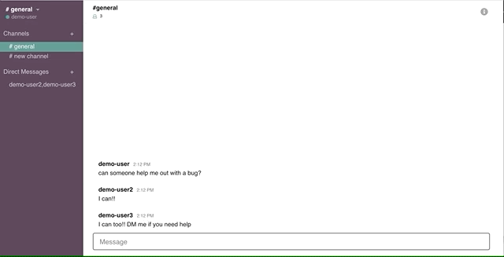

# README

# Hang


## Deployed Product

https://aa-hang.herokuapp.com/#/

## About


Hang is a fullstack project that is built using Javascript, React, and Redux on the frontend and Ruby on Rails on the backend. It has a PostgreSQL database to store the necessary data. The goal of this application is to emulate the features and styling of Slack, which is a productivity and messaging application. 


## Features

#### Live Chat



The core feature of Hang is live chat. It is implemented by using ActionCable, which creates a websocket (and duplex connection) between each user and the server. ActionCable is a built in Rails technology. It broadcasts new messages when the server receives them, organizing them by the current channel or direct thread that they are associated with. The code below represents the key function in the frontend that creates the web socket, creates messages, and receives messages.

```
 createSocket() {
    let cable = Cable.createConsumer();
    this.chats = cable.subscriptions.create(
      {
        channel: "ChatChannel"
      },
      {
        connected: () => {},
        received: data => {
          return this.props.receiveMessage(data);
        },
        create: function(chatContent) {
          this.perform("create", {
            content: chatContent.message,
            user_id: chatContent.user_id,
            chatable_id: chatContent.chatable_id,
            chatable_type: chatContent.chatable_type
          });
        }
      }
    );
  }
  ```
  
#### Creating Channels and Threads

Hang allows you to create and join channels as well as create direct threads. Channels are meant to emulate Slack's own channel feature, and serves as more of an open/private chat room where users can exchange messages. Direct Threads represent simple threads between users. 

Users can pick and choose other users to include in these threads and only those users will be able to see those messages.


## Highlights

#### Polymorphic Associations

The database uses polymorphic associations in two different places that organizes my data in a thoughtful way, by allowing direct threads and channels to be in seperate tables. Polymorphic assoications allow for a piece of data to be associated with multiple other pieces of data. I used them in my messages model and in my memberships model. This design decision was made to properly associate a user's membership with either a direct thread or a channel, as well as do the same with messages.

```
belongs_to :chatable, :polymorphic => true
```

```
belongs_to :membershipable, :polymorphic => true
```

#### Modal Component

The modal component in Hang represents the best practice in React/Redux design. It is a component that renders other components that it receives from the parent container. A modal component was used instead of CSS to manipulate components (such as setting display: none) because doing this manipulates the virtual DOM. React tackles this problem on its own because re-renders are triggered when components receive new props.

```
export default function modalReducer(state = { component: null }, action) {
  switch (action.type) {
    case OPEN_MODAL:
      return { component: action.component };
    case CLOSE_MODAL:
      return { component: null };
    default:
      return state;
  }
}
```


## Thoughts and Future Development

In the future there are several features that I would like to continue to incorporate into Hang.

#### Design 

I would like to continue to work on the ui of Hang. Adding proper animations, adding deveral hover effects, as well as working towards a responsve design are all features I'd like to continue to work on. 

#### Features

I would also like to continue to flesh out several other missing features such as allowing users to add profile pictures, as well as createing another piece of data (workspaces) that would contain seperate channels and direct threads.

