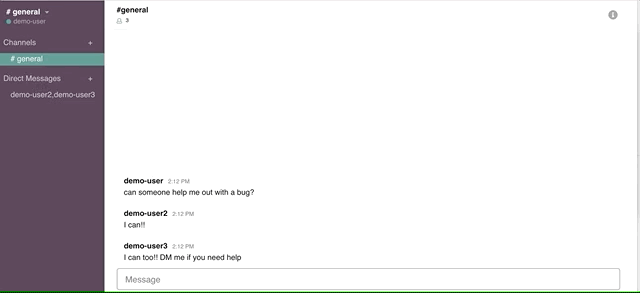

# README


## Deployed Product

https://aa-hang.herokuapp.com/#/

## About


Hang is a fullstack project that is built useing Javascript, React, and Redux on the frontend and Ruby on Rails on the backend. It has a PostreSQL database to store the necessary data. My goal when building out this application was to try and emulate the features and styling of the collaboration application, Slack. 


## Features

#### Live Chat


The core feature of Hang is live chat. It' implemented by useing a Rails technology called ActionCable which creates a websocket (and duplex connection) between each user and the server. It then broadcasts new messages as the server receives organizing them by the current channel or direct thread. The code below represents the key function in the frontend that creates the web socket, creates messages, and receives messages.

```
 createSocket() {
    let cable = Cable.createConsumer();
    this.chats = cable.subscriptions.create(
      {
        channel: "ChatChannel"
      },
      {
        connected: () => {},
        received: data => {
          return this.props.receiveMessage(data);
        },
        create: function(chatContent) {
          this.perform("create", {
            content: chatContent.message,
            user_id: chatContent.user_id,
            chatable_id: chatContent.chatable_id,
            chatable_type: chatContent.chatable_type
          });
        }
      }
    );
  }
  ```
  
#### Creating Channels and Threads

Hang allows you to create and join channels as well as create direct threads. Channels are meant to emulate Slack's own channel feature, and serves as more of an open (or private if desired) chat room where users can exchange messages. Direct Threads representing simple threads between users. Users can pick and choose other users to include in these threads and only those users will be able to see those messages.




## Highlights

#### Polymorphic Associations

In my database I chose to use polymorphic associations in two different places that effectivly organizes my data in a thoughtful way. Simply put, polymorphic assoications allow for association a piece of data with two seperate other pieces of data. I used them in my messages model, as well as in my memberships model. I chose this because it allowed me to properly associate a users membership with either a direct thread or a channel, as well as do the same with messages.

```
belongs_to :chatable, :polymorphic => true
```

```
belongs_to :membershipable, :polymorphic => true
```

This allowed me to silo direct threads and channels into their own tables, creating a much more organized database.

#### Modal Component

The modal component in Hang represents a very good, pure React, design decision. It's essentially a component that simply renders other components on top of whatever is displayed. The reason I chose to use and create a Modal component instead of useing CSS to manipulate components (perhaps setting display: none?) is that doing it using CSS manipulates the virtual DOM. This falls outside best practices and allows me to easily render the Channel Form and Direct Thread Form components by passing them as props, triggering a re-render in React.

```
export default function modalReducer(state = { component: null }, action) {
  switch (action.type) {
    case OPEN_MODAL:
      return { component: action.component };
    case CLOSE_MODAL:
      return { component: null };
    default:
      return state;
  }
}
```


## Thoughts and Future Development

In the future there are several features that I'd like to continue to incorporate into Hang

#### Design 

I'd like to continue to work on the ui of Hang. Adding proper animations, adding deveral hover effects, as well as working towards a responsve design are all features I'd like to continue to work on. 

#### Features

I'd also like to continue to flesh out several other missing features such as allowing users to add profile pictures, as well as createing another piece of data (workspaces) that would contain seperate channels and direct threads.


  

